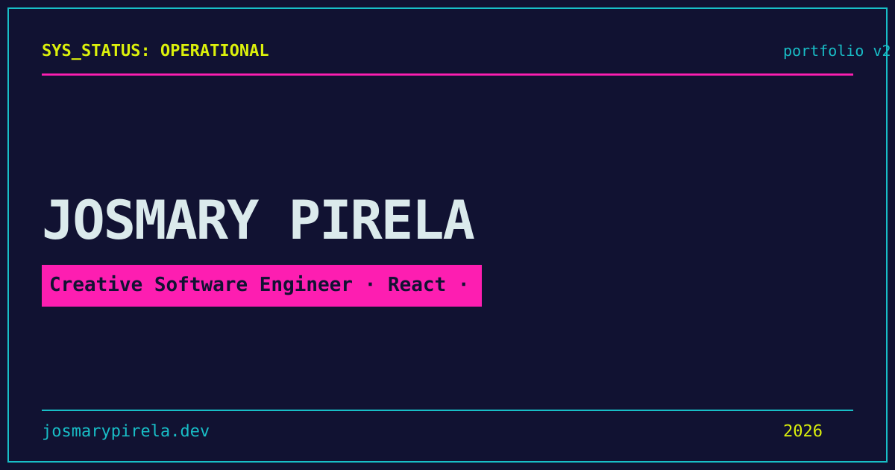

# 👨‍💻 Portfolio — Josmary Pirela

> Personal portfolio with interactive design, retro widgets, synthesized audio, and obsessive performance.

[]()
[]()
[](https://github.com/Josmaryppirelag17/portfolio-next/actions/workflows/ci.yml)
[](https://github.com/Josmaryppirelag17/portfolio-next/actions/workflows/deploy.yml)
[](https://sonarcloud.io/summary/new_code?id=Josmaryppirelag17_portfolio-next)
[](https://sonarcloud.io/summary/new_code?id=Josmaryppirelag17_portfolio-next)




---

## 📊 Quality Audits

| Category | Score (Desktop) | Score (Mobile) | Tools |
|---|---|---|---|
| **Performance** | 90/100 | 81/100 | PageSpeed Insights |
| **Accessibility** | 88/100 | 88/100 | PageSpeed Insights |
| **Best Practices** | 96/100 | 96/100 | PageSpeed Insights |
| **SEO** | 100/100 | 100/100 | PageSpeed Insights |
| **Security** | A+ 🏆 | A+ 🏆 | Mozilla Observatory |

> ✅ **Mozilla Observatory**: A+ — Score: 125/100 (10/10 tests passed).
>
> 🔗 [Mozilla Observatory report](https://developer.mozilla.org/en-US/observatory/analyze?host=josmarypirela.dev)


---

## 🎯 Core Web Vitals (Production - PageSpeed Insights)

### Desktop

| Metric | Value | Rating |
|---|---|---|
| **First Contentful Paint** | 0.3 s | ✅ Good |
| **Largest Contentful Paint** | 0.5 s | ✅ Good |
| **Total Blocking Time** | 20 ms | ✅ Good |
| **Cumulative Layout Shift** | 0.193 | ✅ Good |
| **Speed Index** | 1.2 s | ✅ Good |

### Mobile

| Metric | Value | Rating |
|---|---|---|
| **First Contentful Paint** | 0.9 s | ✅ Good |
| **Largest Contentful Paint** | 2.6 s | ✅ Good |
| **Total Blocking Time** | 180 ms | ✅ Good |
| **Cumulative Layout Shift** | 0.062 | ✅ Good |
| **Speed Index** | 3.3 s | ✅ Good |


> 🔗 [PageSpeed Insights report](https://pagespeed.web.dev/analysis/https-josmarypirela-dev)

---

## ✨ Features

| Feature | Description |
|---|---|
| **Interactive Hero** | Canvas-based animated scene with cursor tracking and 3D parallax |
| **Retro Widgets** | Matrix Rain, Retro Terminal, Pocket Synth, Biorhythm ECG, Core Balancer, Memory Collector |
| **Sound Engine** | Web Audio API synthesizer with oscillator-based sounds, FM synthesis, and radio static |
| **Contact Terminal** | Terminal-styled contact form with honeypot anti-spam and IP-based rate limiting |
| **i18n** | Spanish (135 keys) and English (134 keys) with hot-switching |
| **Security headers** | CSP nonce-based (Mozilla Observatory A+), HSTS, X-Frame-Options, Permissions-Policy |

---

## 🚀 Tech Stack

| Layer | Technology |
|---|---|
| **Framework** | Next.js 16 (App Router) |
| **UI** | React 19 + Tailwind CSS 4 + Motion |
| **Validation** | Zod 4 + react-hook-form |
| **Persistence** | Neon (PostgreSQL serverless) + Drizzle ORM |
| **Email** | Resend (contact form) |
| **Monitoring** | Sentry (errors + performance) |
| **Logger** | Context-scoped structured Logger |
| **Tests** | Vitest (unit/integration) + Playwright (e2e) + K6 (load) |
| **Audio** | Web Audio API (oscillator synth, FM, biquad filters) |
| **Workers** | Web Workers (noise buffer generation) |
| **Quality** | TypeScript strict + ESLint + Prettier + SonarCloud + jscpd |

---

## 🛠️ Scripts

| Command | Description |
|---|---|
| `pnpm dev` | Start development server (Next.js) |
| `pnpm build` | Build for production (Next.js) |
| `pnpm test` | Unit tests with coverage (250 tests) |
| `pnpm test:e2e` | End-to-end tests with Playwright (1 spec) |
| `pnpm typecheck` | TypeScript type checking |
| `pnpm lint` | ESLint (flat config) |
| `pnpm preflight` | typecheck + lint + test (CI ready) |
| `pnpm format` | Format code with Prettier |
| `pnpm format:check` | Check formatting with Prettier |

---

## 🧪 Tests

```bash
pnpm test        # Unit + integration (Vitest) — 250 tests, 45 files
pnpm test:e2e    # E2E (Playwright: Chromium) — 1 spec
pnpm preflight   # typecheck + lint + test (CI pipeline)
```

---

## 📁 Architecture

```
src/
├── app/                       # App Router (pages, API routes, layout, OG image)
│   ├── api/
│   │   ├── contact/           # Contact form endpoint (POST)
│   │   └── sitemap/           # XML sitemap generation
│   ├── layout.tsx
│   ├── page.tsx               # Home (lazy sections: About, Experience, Projects, Skills, Contact)
│   ├── error.tsx
│   ├── loading.tsx
│   ├── not-found.tsx
│   └── opengraph-image.tsx
├── components/                # Atomic Design
│   ├── atoms/                 # SectionFallback, SectionHeader, StructuredData, WidgetShell
│   ├── molecules/             # ErrorBoundary, MatrixRainOverlay, SiteFooter, SiteHeader, Widgets (6)
│   ├── organisms/             # AboutSection, ContactTerminal, CyberAvatar, CyberConsoleWidgets, ExperienceTimeline, HeroPlayground, InteractiveSkills, ProjectsShowcase, SoundEngine
│   └── templates/             # App (main shell)
├── context/                   # LanguageContext (i18n provider)
├── core/                      # Domain (errors, models) + Services (7)
├── hooks/                     # 7 custom hooks (useAudio, useClock, useMatrixEasterEgg, useMobileMenu, usePrefersReducedMotion, useWorker, useCanvas)
├── i18n/                      # ES (135 keys) + EN (134 keys) + types
├── infrastructure/            # Storage adapter, logger
├── lib/                       # Analytics, DB (Drizzle schema, connection), cyberMessages
├── types/                     # Shared TypeScript types
├── utils/                     # escape, errors, focusTrap, analytics
├── workers/                   # noiseBuffer.worker.ts
└── middleware.ts              # CSP nonce + security headers
```

---

## 🚦 CI/CD

### GitHub Actions (`.github/workflows/ci.yml` + `.github/workflows/deploy.yml`)

| Job | Commands | Artifacts (only on failure) |
|---|---|---|
| **lint** | `pnpm lint` | — |
| **test** | `pnpm typecheck` → `pnpm test` | `coverage/` |
| **build** | `pnpm build` (needs lint + test) | — |
| **e2e** | `playwright install chromium` → `pnpm test:e2e` (needs build) | `playwright-report/` |
| **deploy-staging** | Build + Vercel Preview (branch `develop`) | — |
| **deploy-prod** | Build + Vercel Production (branch `main`) | — |
| **rollback** | Manual via `workflow_dispatch` | — |

- `pnpm preflight` for pre-push hook
- SonarCloud analysis after tests
- **Staging**: auto-deploy from `develop`
- **Production**: auto-deploy from `main`
- **Rollback**: manual via GitHub Actions

---


## 📝 Logger

Structured logger with levels (`debug`, `info`, `warn`, `error`) — silenced in production.


---

## 🔐 Environment Variables

See `.env.example` for required variables.

---

## ♿ Accessibility

| Practice | Implementation |
|---|---|
| **Skip to content** | Skip link to main content |
| **ARIA roles** | Semantic roles throughout (`button`, `dialog`, `status`, `img`) |
| **Focus management** | Focus trap in modals, visible focus, logical tab order, keyboard navigation |
| **Reduced motion** | Support for `prefers-reduced-motion: reduce` with class toggle |
| **Contrast** | Sufficient contrast color palette with dark/light themes |
| **Alternative text** | Decorative icons with `aria-hidden`, interactive elements with `aria-label` |

---

## 📦 Quick Deploy

```bash
pnpm install && pnpm dev      # Development
pnpm build && pnpm start       # Production
```

## 🔗 Links

[](https://josmarypirela.dev)
[](https://josmarypirela.dev)

---

## 📜 License

**Code** — The source code in this repository is licensed under the
[MIT License](LICENSE).

**Visual identity** — The brand assets, design system, color palette, logos, and
layout composition are licensed under
[CC BY-NC-SA 4.0](assets/brand/LICENSE).

© 2026 [Josmary Pirela](https://www.josmarypirela.dev)
